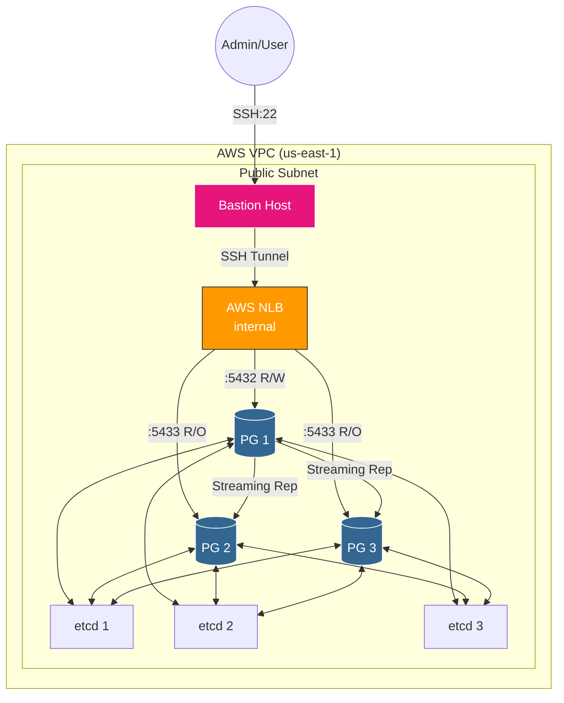

# PostgreSQL HA on EC2 with Terraform


High-availability PostgreSQL cluster on AWS EC2 using Patroni, etcd, and PgBouncer. Fully managed with Terraform.

> **[English](#english)** | **[Português](#portugues)**

---

<a name="english"></a>
## English

This is **v2.0** of the PostgreSQL HA Lab — the cloud-native evolution of [PostgreSQL HA Docker](https://github.com/jean-souto/postgresql-ha-docker). Same battle-tested software stack (Patroni, etcd, PgBouncer), now deployed on production-grade AWS infrastructure with Infrastructure as Code.

```
Portfolio Evolution: v1.0 Docker (done) → v2.0 EC2 + Terraform (current)
```

### Demo: Automatic Failover


*Chaos testing: Patroni stop → PostgreSQL kill → Patroni failover → EC2 stop — all with automatic recovery and zero data loss*

## Documentation

| Document | Description |
|----------|-------------|
| [Setup Guide](docs/runbook-setup.md) | Complete deployment instructions |
| [Operations Runbook](docs/operations-runbook.md) | Failover procedures, incident response |
| [Secrets Management](docs/secrets-management.md) | SSM Parameter Store architecture |

## Architecture



### Component Stack

| Component | Technology | Qty | Purpose |
|-----------|------------|-----|---------|
| PostgreSQL | PostgreSQL 17 | 3 | Primary database |
| Orchestration | Patroni 4.0.4 | 3 | Automatic failover |
| Consensus | etcd 3.5.17 | 3 | Leader election |
| Connection Pool | PgBouncer 1.23.1 | 3 | Connection pooling |
| Load Balancer | AWS NLB | 1 | TCP routing |
| Bastion | EC2 t3.micro | 1 | SSH entry point |

### Key Decisions

| Decision | Rationale |
|----------|-----------|
| **NLB over ALB** | PostgreSQL uses TCP, not HTTP. Lower latency. |
| **SSM Parameter Store** | Free vs $0.40/secret/month (Secrets Manager) |
| **No NAT Gateway** | Saves $32/month. Public subnet + SGs is sufficient. |
| **Single AZ** | Cost optimization for demo. Production: Multi-AZ. |

## Quick Start

```bash
# 1. Clone
git clone https://github.com/jean-souto/postgresql-ha-ec2.git
cd postgresql-ha-ec2

# 2. Configure (see docs/runbook-setup.md for details)
cd terraform && cp terraform.tfvars.example terraform.tfvars
# Edit terraform.tfvars with your values

# 3. Deploy
./scripts/create-cluster.sh

# 4. Test failover
./scripts/chaos-test.sh

# 5. Destroy (IMPORTANT: avoid charges)
./scripts/destroy-cluster.sh
```

See [Setup Guide](docs/runbook-setup.md) for complete instructions.

## Automatic Failover

| Timeline | Event |
|----------|-------|
| T+0s | Primary fails |
| T+10s | NLB health check fails |
| T+12s | Replica acquires leader lock |
| T+15s | Patroni promotes replica |
| T+20s | Traffic routes to new primary |

**RTO**: < 30 seconds | **RPO**: 0 (synchronous replication)

## Cost Estimation

> **Pay-per-use architecture.** Always destroy after testing.

| Usage | Monthly Cost |
|-------|--------------|
| 2h/test (5 tests/month) | ~$8 (Free Tier) |
| 24/7 | ~$89 |

## Skills Demonstrated

| Category | Technologies |
|----------|--------------|
| **IaC** | Terraform, S3 remote state, DynamoDB locking |
| **AWS** | VPC, Subnets, Security Groups, NLB, Elastic IP |
| **HA** | Patroni failover, etcd consensus, NLB health checks |
| **Security** | IAM Roles, SSM Parameter Store, Bastion Host |
| **Automation** | User data scripts, cloud-init, systemd |

## References

- [Patroni Documentation](https://patroni.readthedocs.io/)
- [etcd Operations Guide](https://etcd.io/docs/v3.5/op-guide/)
- [AWS NLB Documentation](https://docs.aws.amazon.com/elasticloadbalancing/latest/network/)
- [Terraform AWS Provider](https://registry.terraform.io/providers/hashicorp/aws/latest/docs)

## Acknowledgments

Developed with assistance from [Claude Code](https://claude.ai/).

## License

This project is licensed under the MIT License.

---

<a name="portugues"></a>
## Português

Esta é a **v2.0** do PostgreSQL HA Lab — a evolução cloud-native do [PostgreSQL HA Docker](https://github.com/jean-souto/postgresql-ha-docker). Mesmo stack de software testado em batalha (Patroni, etcd, PgBouncer), agora deployado em infraestrutura AWS de nível produção com Infrastructure as Code.

```
Evolução do Portfólio: v1.0 Docker (concluído) → v2.0 EC2 + Terraform (atual)
```

### Demo: Failover Automático


*Chaos testing: Patroni stop → PostgreSQL kill → Patroni failover → EC2 stop — todos com recuperação automática e zero perda de dados*

## Documentação

| Documento | Descrição |
|-----------|-----------|
| [Guia de Setup](docs/runbook-setup.md) | Instruções completas de deployment |
| [Manual de Operações](docs/operations-runbook.md) | Procedimentos de failover, resposta a incidentes |
| [Gestão de Secrets](docs/secrets-management.md) | Arquitetura SSM Parameter Store |

## Arquitetura


### Stack de Componentes

| Componente | Tecnologia | Qty | Propósito |
|------------|------------|-----|-----------|
| PostgreSQL | PostgreSQL 17 | 3 | Banco de dados primário |
| Orquestração | Patroni 4.0.4 | 3 | Failover automático |
| Consenso | etcd 3.5.17 | 3 | Eleição de líder |
| Connection Pool | PgBouncer 1.23.1 | 3 | Pool de conexões |
| Load Balancer | AWS NLB | 1 | Roteamento TCP |
| Bastion | EC2 t3.micro | 1 | Ponto de entrada SSH |

### Decisões Técnicas

| Decisão | Justificativa |
|---------|---------------|
| **NLB ao invés de ALB** | PostgreSQL usa TCP, não HTTP. Menor latência. |
| **SSM Parameter Store** | Grátis vs $0.40/secret/mês (Secrets Manager) |
| **Sem NAT Gateway** | Economia de $32/mês. Public subnet + SGs é suficiente. |
| **Single AZ** | Otimização de custo para demo. Produção: Multi-AZ. |

## Início Rápido

```bash
# 1. Clone
git clone https://github.com/jean-souto/postgresql-ha-ec2.git
cd postgresql-ha-ec2

# 2. Configure (veja docs/runbook-setup.md para detalhes)
cd terraform && cp terraform.tfvars.example terraform.tfvars
# Edite terraform.tfvars com seus valores

# 3. Deploy
./scripts/create-cluster.sh

# 4. Teste failover
./scripts/chaos-test.sh

# 5. Destrua (IMPORTANTE: evite cobranças)
./scripts/destroy-cluster.sh
```

Veja [Guia de Setup](docs/runbook-setup.md) para instruções completas.

## Failover Automático

| Timeline | Evento |
|----------|--------|
| T+0s | Primary falha |
| T+10s | Health check NLB falha |
| T+12s | Replica adquire leader lock |
| T+15s | Patroni promove replica |
| T+20s | Tráfego roteado para novo primary |

**RTO**: < 30 segundos | **RPO**: 0 (replicação síncrona)

## Estimativa de Custos

> **Arquitetura pay-per-use.** Sempre destrua após testes.

| Uso | Custo Mensal |
|-----|--------------|
| 2h/teste (5 testes/mês) | ~$8 (Free Tier) |
| 24/7 | ~$89 |

## Skills Demonstradas

| Categoria | Tecnologias |
|-----------|-------------|
| **IaC** | Terraform, S3 remote state, DynamoDB locking |
| **AWS** | VPC, Subnets, Security Groups, NLB, Elastic IP |
| **HA** | Failover Patroni, consenso etcd, health checks NLB |
| **Segurança** | IAM Roles, SSM Parameter Store, Bastion Host |
| **Automação** | User data scripts, cloud-init, systemd |

## Referências

- [Documentação Patroni](https://patroni.readthedocs.io/)
- [Guia de Operações etcd](https://etcd.io/docs/v3.5/op-guide/)
- [Documentação AWS NLB](https://docs.aws.amazon.com/elasticloadbalancing/latest/network/)
- [Terraform AWS Provider](https://registry.terraform.io/providers/hashicorp/aws/latest/docs)

## Agradecimentos

Desenvolvido com assistência do [Claude Code](https://claude.ai/).

## Licença

Este projeto está licenciado sob a Licença MIT.
