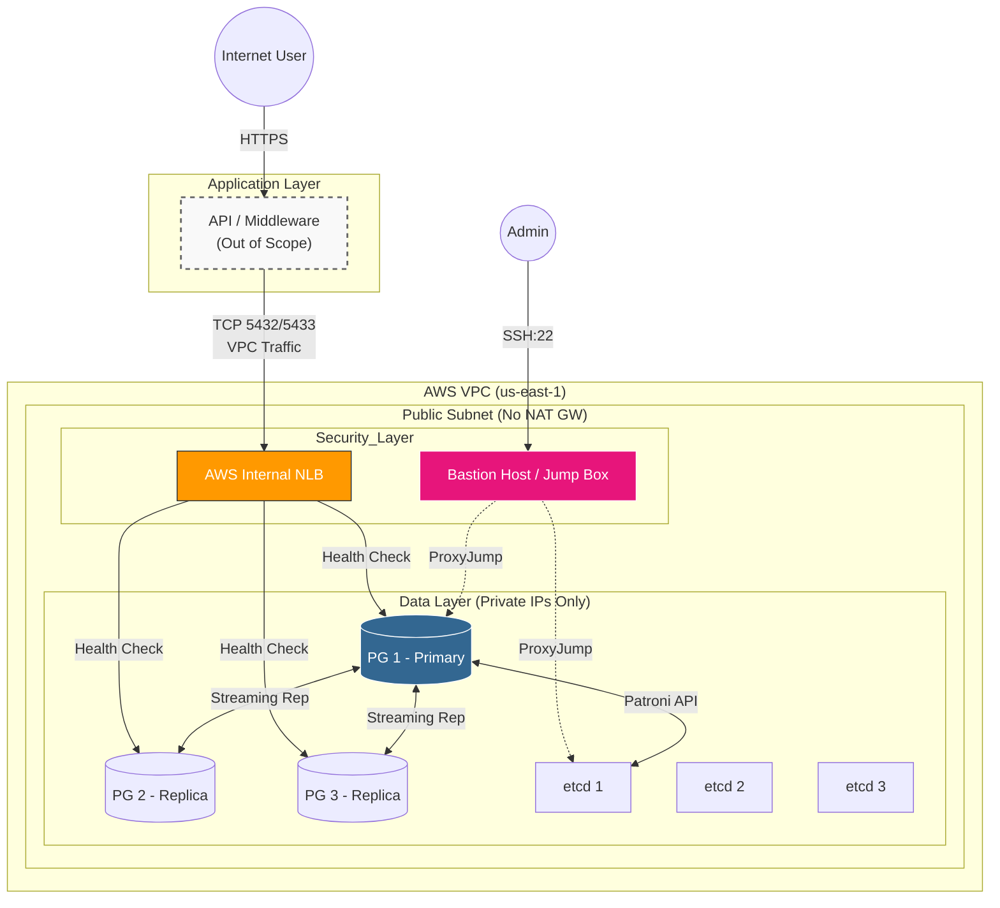

# PostgreSQL HA on EC2 with Terraform

High-availability PostgreSQL cluster on AWS EC2 using Patroni, etcd, and PgBouncer. Fully managed with Terraform.

> **[English](#english)** | **[Português](#português)**

---

<a name="english"></a>
## English

This is **v2.0** of the PostgreSQL HA Lab — the cloud-native evolution of [PostgreSQL HA Docker](https://github.com/jean-souto/postgresql-ha-docker). Same battle-tested software stack (Patroni, etcd, PgBouncer), now deployed on production-grade AWS infrastructure with Infrastructure as Code.

```
Portfolio Evolution:
v1.0 Docker (done) → v2.0 EC2 + Terraform (current)
```

### Demo: Automatic Failover in Action


*EC2 instance stopped (hardware failure simulation) → automatic failover → zero data loss → node reintegration*

### Skills Demonstrated

| Category | Technologies |
|----------|--------------|
| **Infrastructure as Code** | Terraform, S3 remote state, DynamoDB locking |
| **AWS Networking** | VPC, Subnets, Security Groups, NLB, Elastic IP |
| **High Availability** | Patroni automatic failover, etcd consensus, NLB health checks |
| **Security** | IAM Roles, SSM Parameter Store, Bastion Host, least-privilege SGs |
| **Automation** | User data scripts, cloud-init, systemd services |
| **Cost Optimization** | Free Tier usage, pay-per-use architecture, start/stop scripts |


## Architecture



### Component Stack

| Component | Technology | Quantity | Purpose |
|-----------|------------|----------|---------|
| **PostgreSQL** | PostgreSQL 17 | 3 nodes | Primary database |
| **Orchestration** | Patroni 4.0.4 | 3 nodes | Automatic failover & HA management |
| **Consensus** | etcd 3.5.17 | 3 nodes | Distributed leader election |
| **Connection Pool** | PgBouncer 1.23.1 | 3 nodes | Connection pooling |
| **Load Balancer** | AWS NLB | 1 | Health-based routing (TCP Layer 4) |
| **Bastion** | EC2 t3.micro | 1 | Single SSH entry point |

### Key Design Decisions

| Decision | Rationale |
|----------|-----------|
| **NLB instead of ALB** | PostgreSQL uses TCP, not HTTP. NLB has lower latency and supports health checks via Patroni API |
| **SSM Parameter Store** | Free alternative to Secrets Manager ($0 vs $0.40/secret/month) |
| **No NAT Gateway** | Saves $32/month. Public subnet with Security Groups provides sufficient isolation |
| **Single AZ** | Cost optimization for demo. Production would use Multi-AZ |
| **Bastion Host** | Single entry point for SSH. All cluster nodes have private IPs only |


## Automatic Failover

When the primary fails, the cluster automatically recovers:

```
Timeline    Event                                    State
─────────────────────────────────────────────────────────────────────
T+0s        Primary becomes unavailable              Existing connections fail
T+10s       NLB health check fails (/primary 503)    Target marked unhealthy
T+10s       Patroni detects failure via etcd TTL     Lock expires
T+12s       Replica acquires leader lock             Election
T+15s       Patroni promotes replica                 pg_ctl promote
T+20s       New primary responds /primary 200        NLB redirects traffic
T+20s       New connections → new primary            Transparent to client
─────────────────────────────────────────────────────────────────────
            Total: ~20 seconds
            Client reconnects to SAME NLB endpoint
```

**Recovery Objectives:**
- **RTO** (Recovery Time): < 30 seconds
- **RPO** (Recovery Point): 0 (synchronous replication)


## Tested Scenarios

All scenarios validated and working:

- [x] etcd cluster forms quorum (3/3 nodes)
- [x] Patroni elects primary automatically
- [x] Streaming replication to 2 replicas
- [x] NLB health checks correctly identify primary/replicas
- [x] Port 5432 routes to primary (`pg_is_in_recovery = false`)
- [x] Port 5433 routes to replicas (`pg_is_in_recovery = true`)
- [x] Automatic failover on primary failure (~20-30s)
- [x] Data preserved after failover (zero data loss)
- [x] Old primary rejoins as replica via `pg_rewind`


## Cost Estimation

> **Pay-per-use architecture.** Infrastructure runs only during tests. Always destroy after testing.

### Free Tier (first 12 months)

| Usage Pattern | EC2 | EBS | NLB | Total |
|---------------|-----|-----|-----|-------|
| 2h per test (5 tests/month) | $0* | ~$8 | ~$0.25 | **~$8** |
| 24/7 (not recommended) | ~$50 | ~$8 | ~$16 | **~$74** |

*\*750 free EC2 hours/month shared across all instances*

### After Free Tier

| Usage Pattern | Monthly Cost |
|---------------|--------------|
| 24/7 | **~$89** |

### Cost Optimization Strategy

1. **Always destroy after tests**: `./scripts/destroy-cluster.sh`
2. **Set budget alerts**: Recommended $20/month threshold
3. **Use start/stop scripts**: Only pay for what you use


## Quick Start

### Prerequisites

- AWS Account with credentials configured
- Terraform >= 1.6.0
- AWS CLI >= 2.0
- SSH key pair in AWS
- Git Bash or similar (Windows)

### AWS CLI Configuration

This project uses the AWS CLI profile `postgresql-ha-profile`. Configure it before deploying:

```bash
# Configure the profile
aws configure --profile postgresql-ha-profile
# Enter: Access Key ID, Secret Access Key, Region (us-east-1), Output (json)

# Verify configuration
aws sts get-caller-identity --profile postgresql-ha-profile
```

**Expected output:**
```json
{
    "UserId": "AIDAXXXXXXXXXXXXXXXXX",
    "Account": "123456789012",
    "Arn": "arn:aws:iam::123456789012:user/your-user"
}
```

<details>
<summary><strong>Using a different profile name</strong></summary>

To use a different profile, update these files:

1. **`terraform/providers.tf`** - Change the profile name:
   ```hcl
   provider "aws" {
     region  = var.aws_region
     profile = "your-profile-name"  # Change from "postgresql-ha-profile"
   }
   ```

2. **`scripts/config.sh`** - Update the AWS_PROFILE variable:
   ```bash
   export AWS_PROFILE="your-profile-name"
   ```

3. **All scripts in `scripts/`** - Search and replace `--profile postgresql-ha-profile` with your profile name.

</details>

### 1. Clone and Configure

```bash
git clone https://github.com/jean-souto/postgresql-ha-ec2.git
cd postgresql-ha-ec2/terraform

# Copy example files
cp terraform.tfvars.example terraform.tfvars
```

Edit `terraform.tfvars`:
```hcl
aws_account_id = "123456789012"  # Your AWS Account ID
key_name       = "your-ssh-key"   # Your EC2 key pair name
admin_ip       = "YOUR_IP/32"     # Your public IP for SSH access
```

### 2. Configure Scripts

```bash
cd ../scripts
cp config.example.sh config.sh
# Edit config.sh with your SSH key path
```

### 3. Deploy

```bash
./scripts/create-cluster.sh
```

### 4. Connect

```bash
# SSH to Bastion
ssh -i your-key.pem ec2-user@$(terraform output -raw bastion_public_ip)

# SSH to Patroni via Bastion (ProxyJump)
ssh -i your-key.pem -J ec2-user@BASTION_IP ec2-user@PATRONI_PRIVATE_IP

# PostgreSQL via NLB (from Bastion or VPC)
psql -h $(terraform output -raw nlb_dns_name) -p 5432 -U postgres  # R/W
psql -h $(terraform output -raw nlb_dns_name) -p 5433 -U postgres  # RO
```

### 5. Test Failover

```bash
./scripts/chaos-test.sh
```

### 6. Destroy (Important!)

```bash
./scripts/destroy-cluster.sh
```


## Project Structure

```
postgresql-ha-ec2/
├── terraform/
│   ├── main.tf                 # Main configuration, S3 backend resources
│   ├── backend.tf              # S3 backend configuration (optional)
│   ├── providers.tf            # AWS provider with profile
│   ├── versions.tf             # Terraform and provider versions
│   ├── variables.tf            # Input variables
│   ├── outputs.tf              # Output values
│   ├── locals.tf               # Local values and tags
│   ├── data.tf                 # Data sources (AMI, caller identity)
│   ├── vpc.tf                  # VPC, subnet, IGW, route tables
│   ├── security-groups.tf      # Security groups (Patroni, etcd, Bastion)
│   ├── iam.tf                  # IAM roles, policies, instance profiles
│   ├── ssm.tf                  # SSM Parameter Store (secrets)
│   ├── ec2-patroni.tf          # 3x Patroni EC2 instances
│   ├── ec2-etcd.tf             # 3x etcd EC2 instances
│   ├── ec2-bastion.tf          # Bastion host with Elastic IP
│   ├── nlb.tf                  # NLB, target groups, listeners
│   ├── terraform.tfvars.example # Example variables file
│   └── scripts/
│       ├── user-data-patroni.sh.tpl  # Patroni bootstrap script
│       └── user-data-etcd.sh.tpl     # etcd bootstrap script
│
├── scripts/
│   ├── config.example.sh    # Configuration template
│   ├── create-cluster.sh    # Create infrastructure
│   ├── destroy-cluster.sh   # Destroy infrastructure
│   ├── health-check.sh      # Cluster health status
│   ├── chaos-test.sh        # Failover testing
│   ├── insert-loop.sh       # Continuous insert test
│   ├── verify-data.sh       # Data integrity check
│   └── monitor-cluster.sh   # Real-time monitoring
│
├── CHANGELOG.md             # Version history (EN/PT-BR)
└── README.md                # This file (EN/PT-BR)
```


## Security

| Layer | Implementation |
|-------|----------------|
| **Network** | VPC isolation, Security Groups with least-privilege rules |
| **Access** | Bastion Host only, SSH via ProxyJump, no public IPs on cluster nodes |
| **Secrets** | SSM Parameter Store with encryption (AWS managed keys) |
| **IAM** | Instance profiles with minimal permissions |
| **Ports** | Only necessary ports open (22, 2379, 2380, 5432, 6432, 8008) |

### IAM User Permissions

The AWS user/profile running Terraform needs the following minimum permissions:

<details>
<summary><strong>Click to expand IAM Policy JSON</strong></summary>

```json
{
  "Version": "2012-10-17",
  "Statement": [
    {
      "Sid": "EC2Permissions",
      "Effect": "Allow",
      "Action": [
        "ec2:RunInstances",
        "ec2:TerminateInstances",
        "ec2:StartInstances",
        "ec2:StopInstances",
        "ec2:RebootInstances",
        "ec2:DescribeInstances",
        "ec2:DescribeInstanceStatus",
        "ec2:DescribeImages",
        "ec2:DescribeKeyPairs",
        "ec2:DescribeAvailabilityZones",
        "ec2:DescribeAccountAttributes",
        "ec2:CreateTags",
        "ec2:DeleteTags",
        "ec2:DescribeTags",
        "ec2:CreateVolume",
        "ec2:DeleteVolume",
        "ec2:AttachVolume",
        "ec2:DetachVolume",
        "ec2:DescribeVolumes",
        "ec2:ModifyInstanceAttribute"
      ],
      "Resource": "*"
    },
    {
      "Sid": "VPCPermissions",
      "Effect": "Allow",
      "Action": [
        "ec2:CreateVpc",
        "ec2:DeleteVpc",
        "ec2:DescribeVpcs",
        "ec2:ModifyVpcAttribute",
        "ec2:CreateSubnet",
        "ec2:DeleteSubnet",
        "ec2:DescribeSubnets",
        "ec2:CreateInternetGateway",
        "ec2:DeleteInternetGateway",
        "ec2:AttachInternetGateway",
        "ec2:DetachInternetGateway",
        "ec2:DescribeInternetGateways",
        "ec2:CreateRouteTable",
        "ec2:DeleteRouteTable",
        "ec2:CreateRoute",
        "ec2:DeleteRoute",
        "ec2:AssociateRouteTable",
        "ec2:DisassociateRouteTable",
        "ec2:DescribeRouteTables",
        "ec2:CreateSecurityGroup",
        "ec2:DeleteSecurityGroup",
        "ec2:DescribeSecurityGroups",
        "ec2:DescribeSecurityGroupRules",
        "ec2:AuthorizeSecurityGroupIngress",
        "ec2:AuthorizeSecurityGroupEgress",
        "ec2:RevokeSecurityGroupIngress",
        "ec2:RevokeSecurityGroupEgress",
        "ec2:AllocateAddress",
        "ec2:ReleaseAddress",
        "ec2:AssociateAddress",
        "ec2:DisassociateAddress",
        "ec2:DescribeAddresses",
        "ec2:DescribeNetworkInterfaces"
      ],
      "Resource": "*"
    },
    {
      "Sid": "ELBPermissions",
      "Effect": "Allow",
      "Action": [
        "elasticloadbalancing:CreateLoadBalancer",
        "elasticloadbalancing:DeleteLoadBalancer",
        "elasticloadbalancing:DescribeLoadBalancers",
        "elasticloadbalancing:DescribeLoadBalancerAttributes",
        "elasticloadbalancing:ModifyLoadBalancerAttributes",
        "elasticloadbalancing:CreateTargetGroup",
        "elasticloadbalancing:DeleteTargetGroup",
        "elasticloadbalancing:DescribeTargetGroups",
        "elasticloadbalancing:DescribeTargetGroupAttributes",
        "elasticloadbalancing:ModifyTargetGroupAttributes",
        "elasticloadbalancing:CreateListener",
        "elasticloadbalancing:DeleteListener",
        "elasticloadbalancing:DescribeListeners",
        "elasticloadbalancing:RegisterTargets",
        "elasticloadbalancing:DeregisterTargets",
        "elasticloadbalancing:DescribeTargetHealth",
        "elasticloadbalancing:AddTags",
        "elasticloadbalancing:RemoveTags",
        "elasticloadbalancing:DescribeTags"
      ],
      "Resource": "*"
    },
    {
      "Sid": "IAMPermissions",
      "Effect": "Allow",
      "Action": [
        "iam:CreateRole",
        "iam:DeleteRole",
        "iam:GetRole",
        "iam:PassRole",
        "iam:TagRole",
        "iam:UntagRole",
        "iam:ListRoleTags",
        "iam:ListAttachedRolePolicies",
        "iam:ListRolePolicies",
        "iam:AttachRolePolicy",
        "iam:DetachRolePolicy",
        "iam:PutRolePolicy",
        "iam:GetRolePolicy",
        "iam:DeleteRolePolicy",
        "iam:CreateInstanceProfile",
        "iam:DeleteInstanceProfile",
        "iam:GetInstanceProfile",
        "iam:AddRoleToInstanceProfile",
        "iam:RemoveRoleFromInstanceProfile",
        "iam:ListInstanceProfilesForRole"
      ],
      "Resource": "*"
    },
    {
      "Sid": "SSMPermissions",
      "Effect": "Allow",
      "Action": [
        "ssm:PutParameter",
        "ssm:GetParameter",
        "ssm:GetParameters",
        "ssm:DeleteParameter",
        "ssm:DescribeParameters",
        "ssm:ListTagsForResource",
        "ssm:AddTagsToResource",
        "ssm:RemoveTagsFromResource",
        "ssm:SendCommand",
        "ssm:GetCommandInvocation",
        "ssm:DescribeInstanceInformation"
      ],
      "Resource": "*"
    },
    {
      "Sid": "S3PermissionsTerraformState",
      "Effect": "Allow",
      "Action": [
        "s3:CreateBucket",
        "s3:DeleteBucket",
        "s3:ListBucket",
        "s3:GetBucketVersioning",
        "s3:PutBucketVersioning",
        "s3:GetBucketPolicy",
        "s3:PutBucketPolicy",
        "s3:DeleteBucketPolicy",
        "s3:GetBucketAcl",
        "s3:PutBucketAcl",
        "s3:GetBucketCORS",
        "s3:PutBucketPublicAccessBlock",
        "s3:GetBucketPublicAccessBlock",
        "s3:PutObject",
        "s3:GetObject",
        "s3:DeleteObject",
        "s3:PutBucketTagging",
        "s3:GetBucketTagging"
      ],
      "Resource": [
        "arn:aws:s3:::pgha-terraform-state-*",
        "arn:aws:s3:::pgha-terraform-state-*/*"
      ]
    },
    {
      "Sid": "DynamoDBPermissionsTerraformLocks",
      "Effect": "Allow",
      "Action": [
        "dynamodb:CreateTable",
        "dynamodb:DeleteTable",
        "dynamodb:DescribeTable",
        "dynamodb:DescribeContinuousBackups",
        "dynamodb:DescribeTimeToLive",
        "dynamodb:ListTagsOfResource",
        "dynamodb:TagResource",
        "dynamodb:UntagResource",
        "dynamodb:PutItem",
        "dynamodb:GetItem",
        "dynamodb:DeleteItem"
      ],
      "Resource": "arn:aws:dynamodb:*:*:table/pgha-terraform-locks"
    },
    {
      "Sid": "STSPermissions",
      "Effect": "Allow",
      "Action": [
        "sts:GetCallerIdentity"
      ],
      "Resource": "*"
    }
  ]
}
```

</details>

> **Note**: For production use, consider restricting `Resource` fields to specific ARNs instead of `"*"`.


## Comparison: Docker vs EC2

| Aspect | v1.0 Docker | v2.0 EC2 |
|--------|-------------|----------|
| **Environment** | Local (laptop) | AWS Cloud |
| **Networking** | Docker bridge | AWS VPC |
| **Load Balancer** | HAProxy container | AWS NLB |
| **Secrets** | .env file | SSM Parameter Store |
| **Logs** | docker logs | CloudWatch Logs |
| **Storage** | Docker volumes | EBS gp2 |
| **IaC** | docker-compose.yml | Terraform |
| **Cost** | $0 | ~$10-15/month (on-demand) |
| **Skills** | Docker | Docker + AWS + Terraform |

## Known Limitations

1. **Single AZ**: All instances in us-east-1a. Not resilient to AZ failures.
2. **NLB Hairpinning**: Targets cannot connect to their own NLB with client IP preservation.
3. **Free Tier Hours**: 7 instances running 24/7 exceed free tier limits.

## References

- [Patroni Documentation](https://patroni.readthedocs.io/)
- [etcd Operations Guide](https://etcd.io/docs/v3.5/op-guide/)
- [AWS NLB Documentation](https://docs.aws.amazon.com/elasticloadbalancing/latest/network/)
- [Terraform AWS Provider](https://registry.terraform.io/providers/hashicorp/aws/latest/docs)

### Acknowledgments

This project was developed with the assistance of [Claude Code](https://claude.ai/).

### License

This project is licensed under the MIT License.

---

<a name="portugues"></a>
## Português

Esta é a **v2.0** do PostgreSQL HA Lab — a evolução cloud-native do [PostgreSQL HA Docker](https://github.com/jean-souto/postgresql-ha-docker). Mesmo stack de software testado em batalha (Patroni, etcd, PgBouncer), agora implantado em infraestrutura AWS de nível produção com Infrastructure as Code.

```
Evolução do Portfólio:
v1.0 Docker (concluído) → v2.0 EC2 + Terraform (atual)
```

### Demo: Failover Automático em Ação


*Instância EC2 parada (simulação de falha de hardware) → failover automático → zero perda de dados → reintegração do nó*

### Skills Demonstradas

| Categoria | Tecnologias |
|-----------|-------------|
| **Infrastructure as Code** | Terraform, S3 remote state, DynamoDB locking |
| **AWS Networking** | VPC, Subnets, Security Groups, NLB, Elastic IP |
| **Alta Disponibilidade** | Failover automático Patroni, consenso etcd, health checks NLB |
| **Segurança** | IAM Roles, SSM Parameter Store, Bastion Host, SGs com privilégio mínimo |
| **Automação** | User data scripts, cloud-init, serviços systemd |
| **Otimização de Custos** | Uso do Free Tier, arquitetura pay-per-use, scripts start/stop |


## Arquitetura


### Stack de Componentes

| Componente | Tecnologia | Quantidade | Propósito |
|------------|------------|------------|-----------|
| **PostgreSQL** | PostgreSQL 17 | 3 nós | Banco de dados primário |
| **Orquestração** | Patroni 4.0.4 | 3 nós | Failover automático e gestão HA |
| **Consenso** | etcd 3.5.17 | 3 nós | Eleição de líder distribuída |
| **Connection Pool** | PgBouncer 1.23.1 | 3 nós | Pool de conexões |
| **Load Balancer** | AWS NLB | 1 | Roteamento baseado em health (TCP Layer 4) |
| **Bastion** | EC2 t3.micro | 1 | Ponto único de entrada SSH |

### Decisões Técnicas Chave

| Decisão | Justificativa |
|---------|---------------|
| **NLB ao invés de ALB** | PostgreSQL usa TCP, não HTTP. NLB tem menor latência e suporta health checks via API Patroni |
| **SSM Parameter Store** | Alternativa gratuita ao Secrets Manager ($0 vs $0.40/secret/mês) |
| **Sem NAT Gateway** | Economia de $32/mês. Subnet pública com Security Groups fornece isolamento suficiente |
| **Single AZ** | Otimização de custo para demo. Produção usaria Multi-AZ |
| **Bastion Host** | Ponto único de entrada SSH. Todos os nós do cluster têm apenas IPs privados |


## Failover Automático

Quando o primary falha, o cluster recupera automaticamente:

```
Tempo       Evento                                    Estado
─────────────────────────────────────────────────────────────────────
T+0s        Primary fica indisponível                Conexões existentes falham
T+10s       Health check NLB falha (/primary 503)    Target marcado unhealthy
T+10s       Patroni detecta falha via TTL etcd       Lock expira
T+12s       Replica adquire leader lock              Eleição
T+15s       Patroni promove replica                  pg_ctl promote
T+20s       Novo primary responde /primary 200       NLB redireciona tráfego
T+20s       Novas conexões → novo primary            Transparente para cliente
─────────────────────────────────────────────────────────────────────
            Total: ~20 segundos
            Cliente reconecta ao MESMO endpoint NLB
```

**Objetivos de Recuperação:**
- **RTO** (Tempo de Recuperação): < 30 segundos
- **RPO** (Ponto de Recuperação): 0 (replicação síncrona)


## Cenários Testados

Todos os cenários validados e funcionando:

- [x] Cluster etcd forma quorum (3/3 nós)
- [x] Patroni elege primary automaticamente
- [x] Replicação streaming para 2 replicas
- [x] Health checks NLB identificam corretamente primary/replicas
- [x] Porta 5432 roteia para primary (`pg_is_in_recovery = false`)
- [x] Porta 5433 roteia para replicas (`pg_is_in_recovery = true`)
- [x] Failover automático em falha do primary (~20-30s)
- [x] Dados preservados após failover (zero perda de dados)
- [x] Antigo primary reintegra como replica via `pg_rewind`


## Estimativa de Custos

> **Arquitetura pay-per-use.** Infraestrutura roda apenas durante testes. Sempre destrua após testar.

### Free Tier (primeiros 12 meses)

| Padrão de Uso | EC2 | EBS | NLB | Total |
|---------------|-----|-----|-----|-------|
| 2h por teste (5 testes/mês) | $0* | ~$8 | ~$0.25 | **~$8** |
| 24/7 (não recomendado) | ~$50 | ~$8 | ~$16 | **~$74** |

*\*750 horas gratuitas EC2/mês compartilhadas entre todas as instâncias*

### Após Free Tier

| Padrão de Uso | Custo Mensal |
|---------------|--------------|
| 24/7 | **~$89** |

### Estratégia de Economia

1. **Sempre destrua após testes**: `./scripts/destroy-cluster.sh`
2. **Configure alertas de budget**: Limite recomendado $20/mês
3. **Use scripts start/stop**: Pague apenas pelo que usar


## Início Rápido

### Pré-requisitos

- Conta AWS com credenciais configuradas
- Terraform >= 1.6.0
- AWS CLI >= 2.0
- Par de chaves SSH na AWS
- Git Bash ou similar (Windows)

### Configuração do AWS CLI

Este projeto usa o perfil AWS CLI `postgresql-ha-profile`. Configure-o antes do deploy:

```bash
# Configure o perfil
aws configure --profile postgresql-ha-profile
# Informe: Access Key ID, Secret Access Key, Region (us-east-1), Output (json)

# Verifique a configuração
aws sts get-caller-identity --profile postgresql-ha-profile
```

**Saída esperada:**
```json
{
    "UserId": "AIDAXXXXXXXXXXXXXXXXX",
    "Account": "123456789012",
    "Arn": "arn:aws:iam::123456789012:user/seu-usuario"
}
```

<details>
<summary><strong>Usando um nome de perfil diferente</strong></summary>

Para usar um perfil diferente, atualize estes arquivos:

1. **`terraform/providers.tf`** - Altere o nome do perfil:
   ```hcl
   provider "aws" {
     region  = var.aws_region
     profile = "seu-perfil"  # Altere de "postgresql-ha-profile"
   }
   ```

2. **`scripts/config.sh`** - Atualize a variável AWS_PROFILE:
   ```bash
   export AWS_PROFILE="seu-perfil"
   ```

3. **Todos os scripts em `scripts/`** - Busque e substitua `--profile postgresql-ha-profile` pelo seu perfil.

</details>

### 1. Clone e Configure

```bash
git clone https://github.com/jean-souto/postgresql-ha-ec2.git
cd postgresql-ha-ec2/terraform

# Copie arquivos de exemplo
cp terraform.tfvars.example terraform.tfvars
```

Edite `terraform.tfvars`:
```hcl
aws_account_id = "123456789012"  # Seu AWS Account ID
key_name       = "sua-chave-ssh"  # Nome do seu key pair EC2
admin_ip       = "SEU_IP/32"      # Seu IP público para acesso SSH
```

### 2. Configure os Scripts

```bash
cd ../scripts
cp config.example.sh config.sh
# Edite config.sh com o caminho da sua chave SSH
```

### 3. Deploy

```bash
./scripts/create-cluster.sh
```

### 4. Conecte

```bash
# SSH para o Bastion
ssh -i sua-chave.pem ec2-user@$(terraform output -raw bastion_public_ip)

# SSH para Patroni via Bastion (ProxyJump)
ssh -i sua-chave.pem -J ec2-user@BASTION_IP ec2-user@PATRONI_PRIVATE_IP

# PostgreSQL via NLB (do Bastion ou VPC)
psql -h $(terraform output -raw nlb_dns_name) -p 5432 -U postgres  # R/W
psql -h $(terraform output -raw nlb_dns_name) -p 5433 -U postgres  # RO
```

### 5. Teste Failover

```bash
./scripts/chaos-test.sh
```

### 6. Destrua (Importante!)

```bash
./scripts/destroy-cluster.sh
```


## Estrutura do Projeto

```
postgresql-ha-ec2/
├── terraform/
│   ├── main.tf                 # Configuração principal, recursos S3 backend
│   ├── backend.tf              # Configuração S3 backend (opcional)
│   ├── providers.tf            # Provider AWS com perfil
│   ├── versions.tf             # Versões Terraform e providers
│   ├── variables.tf            # Variáveis de entrada
│   ├── outputs.tf              # Valores de saída
│   ├── locals.tf               # Valores locais e tags
│   ├── data.tf                 # Data sources (AMI, caller identity)
│   ├── vpc.tf                  # VPC, subnet, IGW, route tables
│   ├── security-groups.tf      # Security groups (Patroni, etcd, Bastion)
│   ├── iam.tf                  # IAM roles, policies, instance profiles
│   ├── ssm.tf                  # SSM Parameter Store (secrets)
│   ├── ec2-patroni.tf          # 3x instâncias EC2 Patroni
│   ├── ec2-etcd.tf             # 3x instâncias EC2 etcd
│   ├── ec2-bastion.tf          # Bastion host com Elastic IP
│   ├── nlb.tf                  # NLB, target groups, listeners
│   ├── terraform.tfvars.example # Arquivo de variáveis exemplo
│   └── scripts/
│       ├── user-data-patroni.sh.tpl  # Script bootstrap Patroni
│       └── user-data-etcd.sh.tpl     # Script bootstrap etcd
│
├── scripts/
│   ├── config.example.sh    # Template de configuração
│   ├── create-cluster.sh    # Criar infraestrutura
│   ├── destroy-cluster.sh   # Destruir infraestrutura
│   ├── health-check.sh      # Status de saúde do cluster
│   ├── chaos-test.sh        # Teste de failover
│   ├── insert-loop.sh       # Teste de insert contínuo
│   ├── verify-data.sh       # Verificação de integridade
│   └── monitor-cluster.sh   # Monitoramento em tempo real
│
├── CHANGELOG.md             # Histórico de versões (EN/PT-BR)
└── README.md                # Este arquivo (EN/PT-BR)
```


## Segurança

| Camada | Implementação |
|--------|---------------|
| **Rede** | Isolamento VPC, Security Groups com regras de privilégio mínimo |
| **Acesso** | Apenas Bastion Host, SSH via ProxyJump, sem IPs públicos nos nós do cluster |
| **Secrets** | SSM Parameter Store com criptografia (chaves gerenciadas AWS) |
| **IAM** | Instance profiles com permissões mínimas |
| **Portas** | Apenas portas necessárias abertas (22, 2379, 2380, 5432, 6432, 8008) |

### Permissões IAM do Usuário

O usuário/perfil AWS que executa o Terraform precisa das seguintes permissões mínimas:

<details>
<summary><strong>Clique para expandir o JSON da Policy IAM</strong></summary>

```json
{
  "Version": "2012-10-17",
  "Statement": [
    {
      "Sid": "EC2Permissions",
      "Effect": "Allow",
      "Action": [
        "ec2:RunInstances",
        "ec2:TerminateInstances",
        "ec2:StartInstances",
        "ec2:StopInstances",
        "ec2:RebootInstances",
        "ec2:DescribeInstances",
        "ec2:DescribeInstanceStatus",
        "ec2:DescribeImages",
        "ec2:DescribeKeyPairs",
        "ec2:DescribeAvailabilityZones",
        "ec2:DescribeAccountAttributes",
        "ec2:CreateTags",
        "ec2:DeleteTags",
        "ec2:DescribeTags",
        "ec2:CreateVolume",
        "ec2:DeleteVolume",
        "ec2:AttachVolume",
        "ec2:DetachVolume",
        "ec2:DescribeVolumes",
        "ec2:ModifyInstanceAttribute"
      ],
      "Resource": "*"
    },
    {
      "Sid": "VPCPermissions",
      "Effect": "Allow",
      "Action": [
        "ec2:CreateVpc",
        "ec2:DeleteVpc",
        "ec2:DescribeVpcs",
        "ec2:ModifyVpcAttribute",
        "ec2:CreateSubnet",
        "ec2:DeleteSubnet",
        "ec2:DescribeSubnets",
        "ec2:CreateInternetGateway",
        "ec2:DeleteInternetGateway",
        "ec2:AttachInternetGateway",
        "ec2:DetachInternetGateway",
        "ec2:DescribeInternetGateways",
        "ec2:CreateRouteTable",
        "ec2:DeleteRouteTable",
        "ec2:CreateRoute",
        "ec2:DeleteRoute",
        "ec2:AssociateRouteTable",
        "ec2:DisassociateRouteTable",
        "ec2:DescribeRouteTables",
        "ec2:CreateSecurityGroup",
        "ec2:DeleteSecurityGroup",
        "ec2:DescribeSecurityGroups",
        "ec2:DescribeSecurityGroupRules",
        "ec2:AuthorizeSecurityGroupIngress",
        "ec2:AuthorizeSecurityGroupEgress",
        "ec2:RevokeSecurityGroupIngress",
        "ec2:RevokeSecurityGroupEgress",
        "ec2:AllocateAddress",
        "ec2:ReleaseAddress",
        "ec2:AssociateAddress",
        "ec2:DisassociateAddress",
        "ec2:DescribeAddresses",
        "ec2:DescribeNetworkInterfaces"
      ],
      "Resource": "*"
    },
    {
      "Sid": "ELBPermissions",
      "Effect": "Allow",
      "Action": [
        "elasticloadbalancing:CreateLoadBalancer",
        "elasticloadbalancing:DeleteLoadBalancer",
        "elasticloadbalancing:DescribeLoadBalancers",
        "elasticloadbalancing:DescribeLoadBalancerAttributes",
        "elasticloadbalancing:ModifyLoadBalancerAttributes",
        "elasticloadbalancing:CreateTargetGroup",
        "elasticloadbalancing:DeleteTargetGroup",
        "elasticloadbalancing:DescribeTargetGroups",
        "elasticloadbalancing:DescribeTargetGroupAttributes",
        "elasticloadbalancing:ModifyTargetGroupAttributes",
        "elasticloadbalancing:CreateListener",
        "elasticloadbalancing:DeleteListener",
        "elasticloadbalancing:DescribeListeners",
        "elasticloadbalancing:RegisterTargets",
        "elasticloadbalancing:DeregisterTargets",
        "elasticloadbalancing:DescribeTargetHealth",
        "elasticloadbalancing:AddTags",
        "elasticloadbalancing:RemoveTags",
        "elasticloadbalancing:DescribeTags"
      ],
      "Resource": "*"
    },
    {
      "Sid": "IAMPermissions",
      "Effect": "Allow",
      "Action": [
        "iam:CreateRole",
        "iam:DeleteRole",
        "iam:GetRole",
        "iam:PassRole",
        "iam:TagRole",
        "iam:UntagRole",
        "iam:ListRoleTags",
        "iam:ListAttachedRolePolicies",
        "iam:ListRolePolicies",
        "iam:AttachRolePolicy",
        "iam:DetachRolePolicy",
        "iam:PutRolePolicy",
        "iam:GetRolePolicy",
        "iam:DeleteRolePolicy",
        "iam:CreateInstanceProfile",
        "iam:DeleteInstanceProfile",
        "iam:GetInstanceProfile",
        "iam:AddRoleToInstanceProfile",
        "iam:RemoveRoleFromInstanceProfile",
        "iam:ListInstanceProfilesForRole"
      ],
      "Resource": "*"
    },
    {
      "Sid": "SSMPermissions",
      "Effect": "Allow",
      "Action": [
        "ssm:PutParameter",
        "ssm:GetParameter",
        "ssm:GetParameters",
        "ssm:DeleteParameter",
        "ssm:DescribeParameters",
        "ssm:ListTagsForResource",
        "ssm:AddTagsToResource",
        "ssm:RemoveTagsFromResource",
        "ssm:SendCommand",
        "ssm:GetCommandInvocation",
        "ssm:DescribeInstanceInformation"
      ],
      "Resource": "*"
    },
    {
      "Sid": "S3PermissionsTerraformState",
      "Effect": "Allow",
      "Action": [
        "s3:CreateBucket",
        "s3:DeleteBucket",
        "s3:ListBucket",
        "s3:GetBucketVersioning",
        "s3:PutBucketVersioning",
        "s3:GetBucketPolicy",
        "s3:PutBucketPolicy",
        "s3:DeleteBucketPolicy",
        "s3:GetBucketAcl",
        "s3:PutBucketAcl",
        "s3:GetBucketCORS",
        "s3:PutBucketPublicAccessBlock",
        "s3:GetBucketPublicAccessBlock",
        "s3:PutObject",
        "s3:GetObject",
        "s3:DeleteObject",
        "s3:PutBucketTagging",
        "s3:GetBucketTagging"
      ],
      "Resource": [
        "arn:aws:s3:::pgha-terraform-state-*",
        "arn:aws:s3:::pgha-terraform-state-*/*"
      ]
    },
    {
      "Sid": "DynamoDBPermissionsTerraformLocks",
      "Effect": "Allow",
      "Action": [
        "dynamodb:CreateTable",
        "dynamodb:DeleteTable",
        "dynamodb:DescribeTable",
        "dynamodb:DescribeContinuousBackups",
        "dynamodb:DescribeTimeToLive",
        "dynamodb:ListTagsOfResource",
        "dynamodb:TagResource",
        "dynamodb:UntagResource",
        "dynamodb:PutItem",
        "dynamodb:GetItem",
        "dynamodb:DeleteItem"
      ],
      "Resource": "arn:aws:dynamodb:*:*:table/pgha-terraform-locks"
    },
    {
      "Sid": "STSPermissions",
      "Effect": "Allow",
      "Action": [
        "sts:GetCallerIdentity"
      ],
      "Resource": "*"
    }
  ]
}
```

</details>

> **Nota**: Para uso em produção, considere restringir os campos `Resource` para ARNs específicos ao invés de `"*"`.


## Comparativo: Docker vs EC2

| Aspecto | v1.0 Docker | v2.0 EC2 |
|---------|-------------|----------|
| **Ambiente** | Local (laptop) | AWS Cloud |
| **Rede** | Docker bridge | AWS VPC |
| **Load Balancer** | Container HAProxy | AWS NLB |
| **Secrets** | Arquivo .env | SSM Parameter Store |
| **Logs** | docker logs | CloudWatch Logs |
| **Storage** | Docker volumes | EBS gp2 |
| **IaC** | docker-compose.yml | Terraform |
| **Custo** | $0 | ~$10-15/mês (sob demanda) |
| **Skills** | Docker | Docker + AWS + Terraform |


## Limitações Conhecidas

1. **Single AZ**: Todas as instâncias em us-east-1a. Não resiliente a falhas de AZ.
2. **NLB Hairpinning**: Targets não podem conectar ao próprio NLB com preservação de IP do cliente.
3. **Horas Free Tier**: 7 instâncias rodando 24/7 excedem os limites do free tier.


## Referências

- [Documentação Patroni](https://patroni.readthedocs.io/)
- [Guia de Operações etcd](https://etcd.io/docs/v3.5/op-guide/)
- [Documentação AWS NLB](https://docs.aws.amazon.com/elasticloadbalancing/latest/network/)
- [Terraform AWS Provider](https://registry.terraform.io/providers/hashicorp/aws/latest/docs)

### Agradecimentos

Este projeto foi desenvolvido com a assistência do [Claude Code](https://claude.ai/).

### Licença

Este projeto está licenciado sob a Licença MIT.